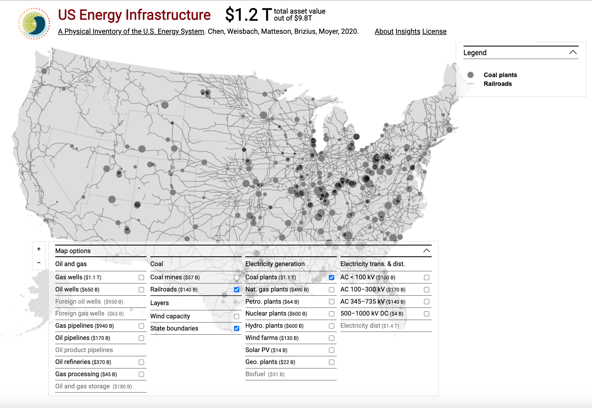

# Energy Infrastructure API

## US Energy Infrastructure Visualization

The [US Energy Infrastructure Visualization](http://us.infrastructure.rdcep.org/) is a data visualization created by Nathan Matteson and Benjamin Kleeman through the [Center for Research-based Decision Making on Climate and Energy Policy]() (RDCEP) that documents all long-lived infrastructure (> 20 years service life) associated with extracting, processing, transporting, and converting energy in the U.S.

The project is an effort of the University of Chicago’s Center for Robust Decision-making on Climate and Energy Policy (RDCEP). Its research is documented in Chen et al 2020, [“A Physical Inventory of the U.S. Energy System”](), which includes documentation on data sources, validation, and comparison to estimates of depreciated value (~50% of replacement value). This paper is currently in preparation for peer review and is available here as a preprint. See also [www.rdcep.org]) for further information. All data are available on request. 

